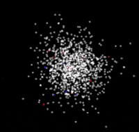
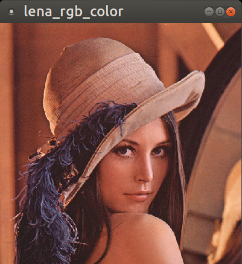

# GL
OpenGL examples

#### usage

`make`

#### dependencies

* OpenBLAS
* OpenGL
* c++14

#### Visualize points in 3D space

`./test`

#### Multiple windows demo + read file + display matrix

`./gltest`

#### CUDA + OpenGL

Create OpenGL texture (256 x 256), then create (256 x 256) grid of CUDA threads and run Conway's Game of Life on GPU

